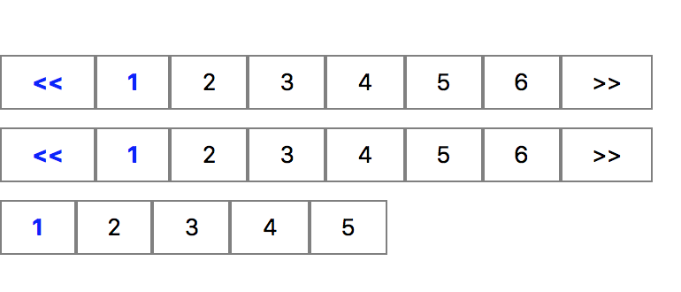

# React-js-paginator
Simple react JS paginator

# Description

Simple React JS Pagination component. Can be easily customized with CSS objects

# How it looks



# Installation

Install it from npm and include it in your React build process (using Webpack, Browserify, etc).

```
npm i react-js-paginator
```

# Usage

It is really easy to use, just: 

Import `Paginator` in your react component.

```javascript
import Paginator from 'react-js-paginator';
```

And then specify the page size, total elements and a callback function.

For example:
```javascript
<Paginator
  pageSize={10}
  totalElements={64}
  onPageChangeCallback={(e) => {this.pageChange(e)}}
/>
```
Once the page has changed, will trigger the callback function and send back the current page.

# Props

| Name        | Type            | Mandatory | Description  
| ------------- |:-------------:| -----:|:-----|
| pageSize      | int | Y |How many elements will compose a page |
| totalElements | int | Y   | Total elements you have in store |
| onPageChangeCallback | function    | Y| function to be triggered when a page change happens |


# License 

Licensed under the MIT License.
