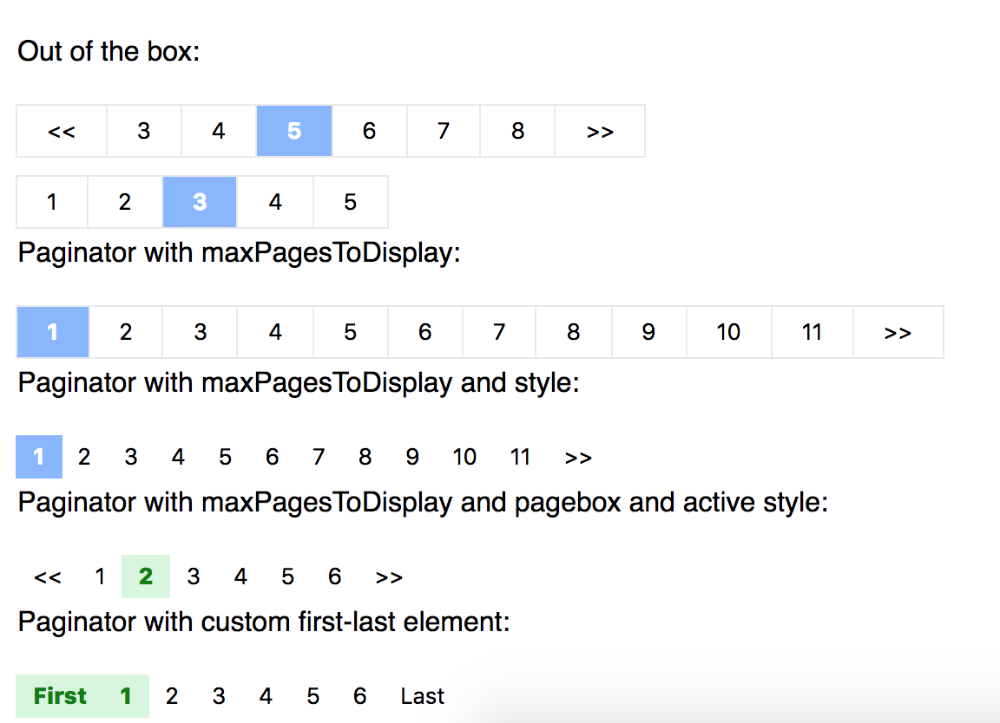
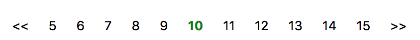

# React-js-paginator
Simple react JS paginator

# Description

Simple React JS Pagination component. Can be easily customized with CSS objects

# How it looks



**How to thank me?**
Just click on ⭐️ button :)

# Installation

Install it from npm and include it in your React build process (using Webpack, Browserify, etc).

```
npm i react-js-paginator
```

# Usage

It is really easy to use, just: 

Import `Paginator` in your react component.

```javascript
import Paginator from 'react-js-paginator';
```

And then specify the page size, total elements and a callback function.

For example:
```javascript
<Paginator
  pageSize={10}
  totalElements={64}
  onPageChangeCallback={(e) => {this.pageChange(e)}}
/>
```
Once the page has changed, will trigger the callback function and send back the current page.

Styles can be customized using `pageBoxStyle` and `activePageBoxStyle` props like:

```javascript
pageBoxStyle={{
	border: 0, 
	color: 'black', 
	padding: 3, 
	fontSize: 16
}}
```

```javascript
activePageBoxStyle={{
	fontWeight: 'bolder', 
	color: 'green', 
	backgroundColor: '#d7f7dc'
}}
```

Giving you as result:




# Props

| Name        | Type            | Mandatory | Description  
| ------------- |:-------------:| -----:|:-----|
| pageSize      | int | Y |How many elements will compose a page |
| totalElements | int | Y   | Total elements you have in store |
| onPageChangeCallback | function    | Y| function to be triggered when a page change happens |
| pageBoxStyle | object    | N| style object for each pagination box |
| activePageBoxStyle | object    | N| style object the active page |
| maxPagesToDisplay | int    | N| how many pages will be displayed at the same time in the paginator (default 6)|
|firstArrowAlwaysVisible|present|N|showAlways the first page arrow|
|lastArrowAlwaysVisible|present|N|showAlways the first page arrow|
|firstArrowSymbol|string|N|customize first page symbol (default <<)|
|lastArrowSymbol|string|N|customize last page symbol (default >>)|

# What's new

0.1.8
* Background updated to be transparent

0.1.7
* CSS updated to be isolated under `paginator` class

0.1.5
* Typecheck added, minor tweaking and styling changes

0.1.3
* Bug fixing: last page was not always being showed.

0.1.1
* Fixed issue where maxPagesToDisplay was showing one more page than the prop number

0.1.0
* New default style (less ugly)
* Style customization properties enhanced

0.0.8
* Added props to force first and last arrows
* Added props to customize first and last symbols

0.0.6
* Added functionality to hide arrows if first page or last page is visible

# License 

Licensed under the MIT License © [jciccio](https://www.npmjs.com/~jciccio)
